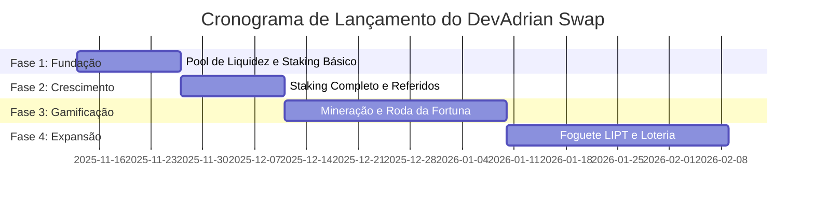

# Plano de Lançamento em Fases: DevAdrian Swap

## Visão Geral

Este documento detalha a estratégia de lançamento progressivo (phased rollout) para o projeto **DevAdrian Swap**. O objetivo é maximizar a liquidez, garantir a segurança, construir uma comunidade forte e gerar hype contínuo.

## Fases do Lançamento

### Fase 1: Fundação (Semanas 1-2)

**Objetivo:** Estabelecer a liquidez inicial, validar a funcionalidade principal e construir a confiança da comunidade.

| Funcionalidades | Detalhes |
|---|---|
| **Pool de Liquidez (Swap)** | Permitir a compra e venda de LIPT com USDT. |
| **Staking Básico** | Liberar apenas os planos de 20 e 30 dias. |

**Metas de Liquidez:**
- **Mínima:** $5,000 USDT + LIPT equivalente
- **Ideal:** $10,000 USDT + LIPT equivalente

**Estratégia de Marketing:**
- Anunciar o lançamento no Twitter, Telegram e Discord.
- Focar na segurança, no modelo de Tokenomics e na auditoria (se houver).
- Oferecer um bônus de APY para os primeiros stakers.

### Fase 2: Crescimento (Semanas 3-4)

**Objetivo:** Expandir a base de usuários e aumentar o volume de negociação.

| Funcionalidades | Detalhes |
|---|---|
| **Todos os Planos de Staking** | Liberar os planos de 60 e 90 dias. |
| **Sistema de Referidos** | Ativar o programa de referidos para incentivar o crescimento orgânico. |

**Metas de Liquidez:**
- **Mínima:** $20,000 USDT
- **Ideal:** $50,000 USDT

**Estratégia de Marketing:**
- Campanha "Convide um Amigo" com recompensas em LIPT.
- Parcerias com pequenos influenciadores de DeFi.
- Artigos no Medium explicando o sistema de referidos.

### Fase 3: Gamificação (Mês 2)

**Objetivo:** Aumentar o engajamento, a retenção de usuários e a queima de tokens.

| Funcionalidades | Detalhes |
|---|---|
| **Mineração** | Liberar os planos de mineração. |
| **Roda da Fortuna** | Lançar o primeiro jogo para aumentar a utilidade do LIPT. |

**Metas de Liquidez:**
- **Mínima:** $100,000 USDT
- **Ideal:** $250,000 USDT

**Estratégia de Marketing:**
- Competição de mineração com prêmios para os maiores mineradores.
- Campanha "Gire e Ganhe" para promover a Roda da Fortuna.
- Vídeos demonstrando como jogar e ganhar.

### Fase 4: Expansão (Mês 3+)

**Objetivo:** Manter o interesse, atrair novos públicos e solidificar a posição no mercado.

| Funcionalidades | Detalhes |
|---|---|
| **Foguete LIPT** | Lançar o jogo de crash para atrair um público mais voltado para jogos de aposta. |
| **Loteria Diária** | Lançar a loteria para criar um evento diário e queimar mais tokens. |

**Metas de Liquidez:**
- **Mínima:** $500,000 USDT
- **Ideal:** $1,000,000+ USDT

**Estratégia de Marketing:**
- Grandes competições de jogos com prêmios em USDT e LIPT.
- Parcerias com comunidades de jogos e apostas.
- Anúncios pagos em plataformas de criptomoedas.

## Cronograma Visual

## Justificativa da Estratégia

- **Segurança:** Lançar em fases permite testar cada funcionalidade em um ambiente real, mas controlado.
- **Liquidez:** Focar a liquidez inicial no pool principal garante um preço estável e menos slippage.
- **Marketing:** Cada fase é uma oportunidade para gerar notícias, hype e atrair novos usuários.
- **Comunidade:** A comunidade se sente parte do crescimento do projeto, vendo as novidades serem lançadas progressivamente.

Este plano fornece uma estrutura sólida para o lançamento do **DevAdrian Swap**, mas deve ser flexível para se adaptar às condições do mercado e ao feedback da comunidade.
